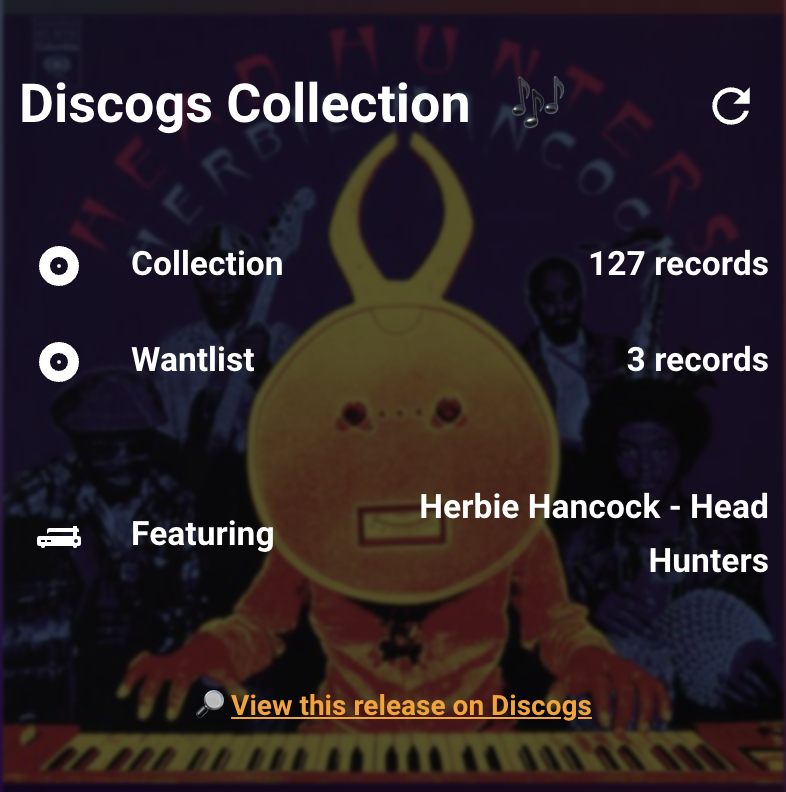
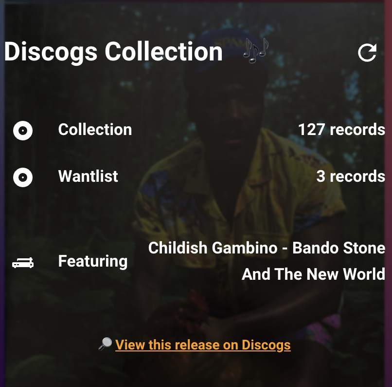
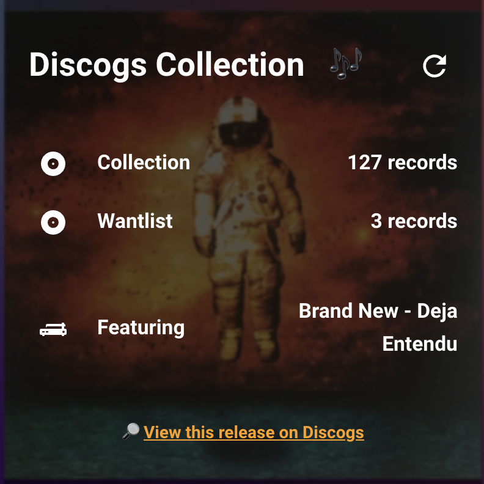
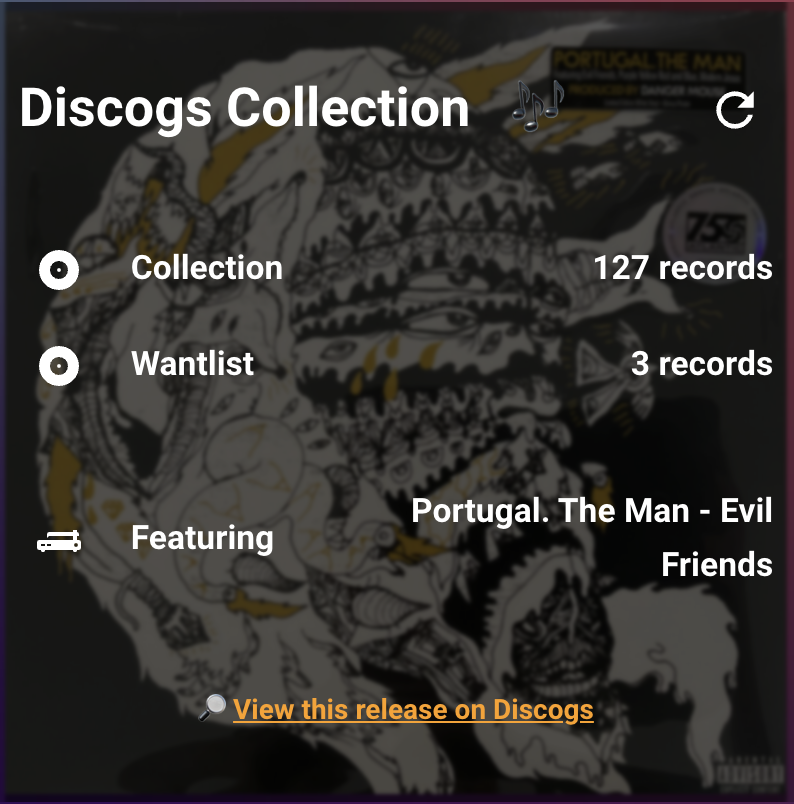

# Discogs for Home Assistant

[](https://github.com/hacs/integration)
[](https://my.home-assistant.io/redirect/hacs_repository/?owner=trevnologies&repository=ha-discogs-addon&category=integration)

<p align="center">
  <table>
    <tr>
      <td></td>
      <td></td>
    </tr>
    <tr>
      <td></td>
      <td></td>
    </tr>
  </table>
</p>

Home Assistant sensor integration for Discogs — collection count, wantlist
count, and a random record suggestion from your collection.

This integration was originally part of Home Assistant core
(`homeassistant.components.discogs`), written by [@thibmaek](https://github.com/thibmaek).
It was removed from core and is maintained here as a standalone custom
integration.

## Installation

### HACS (one click)
Click the "Open your Home Assistant instance" badge above — it opens
your HA instance directly to the "add custom repository" dialog with
this repo pre-filled. Confirm, then find "Discogs" in HACS and install.

Requires [My Home Assistant](https://www.home-assistant.io/integrations/my/)
to be configured on your instance (on by default for most setups).

### HACS (manual)
1. HACS → Integrations → ⋮ (top right) → Custom repositories
2. Repository: `https://github.com/trevnologies/ha-discogs-addon`, Category: Integration
3. Search for "Discogs" and install
4. Restart Home Assistant

### Manual (no HACS)
Copy `custom_components/discogs` into your `/config/custom_components/`
directory and restart Home Assistant.

## Configuration

```yaml
sensor:
  - platform: discogs
    token: !secret discogs_token
    monitored_conditions:
      - collection
      - wantlist
      - random_record
```

Get a personal access token from your
[Discogs developer settings](https://www.discogs.com/settings/developers)
and add it to `secrets.yaml` as `discogs_token`.

`monitored_conditions` is technically optional — it defaults to all
three (`collection`, `wantlist`, `random_record`) if omitted. It's
shown explicitly here because if you plan to use the dashboard card
in `extras/` (below), all three are required — the card reads
`sensor.discogs_collection`, `sensor.discogs_wantlist`, and
`sensor.discogs_random_record` directly, so trimming this list down
will silently break it.

### Adjusting the refresh interval

The integration polls Discogs every hour by default. To change that,
add `scan_interval` to the platform config — this is a built-in option
on all legacy YAML-platform sensors, not something specific to this
integration, so no code changes are needed:

```yaml
sensor:
  - platform: discogs
    token: !secret discogs_token
    scan_interval: "00:30:00"   # HH:MM:SS, or a plain number of seconds
    monitored_conditions:
      - collection
      - wantlist
      - random_record
```

If you're using the `extras/` dashboard pipeline, this interval is
also what paces the whole card-refresh chain — the automation in
`extras/automations.yaml` triggers off `sensor.discogs_random_record`
changing state, so a shorter `scan_interval` means the cover art
refreshes more often too.

## Optional: dashboard card + auto-refreshing cover art

See [`extras/README.md`](extras/README.md) for the full setup — an
automation, script, shell command, a couple of file sensors, and a
dashboard card that together show a random record with cover art that
refreshes automatically. Not required for the core integration to work;
purely a nice-to-have on top of it.

## License

Apache License 2.0 (inherited from home-assistant/core, the original
source of this integration).