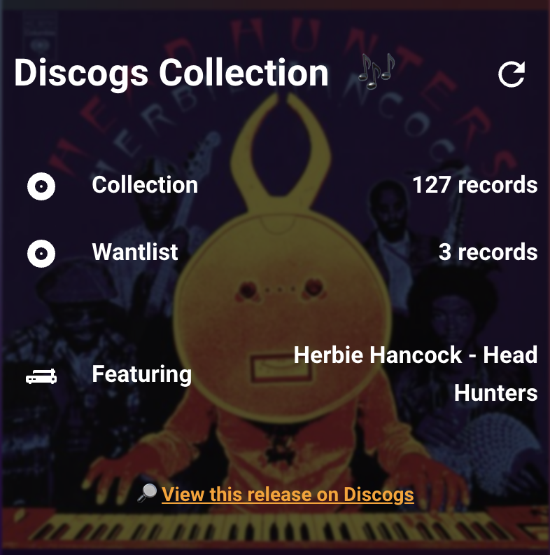
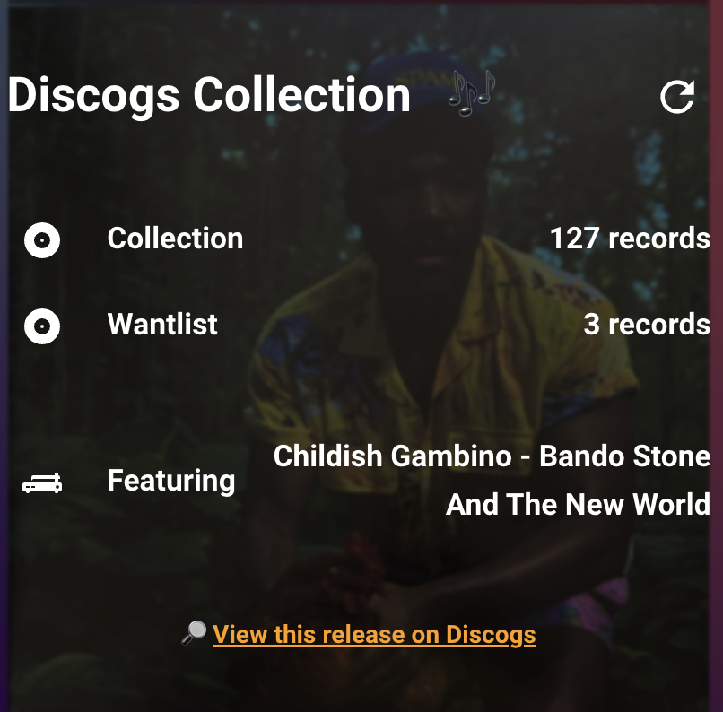
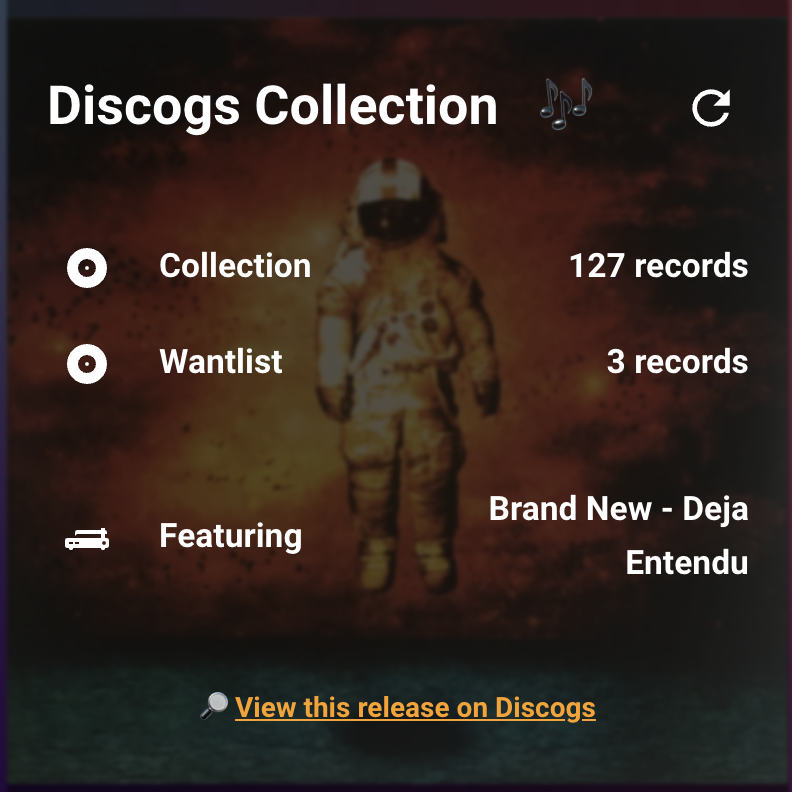
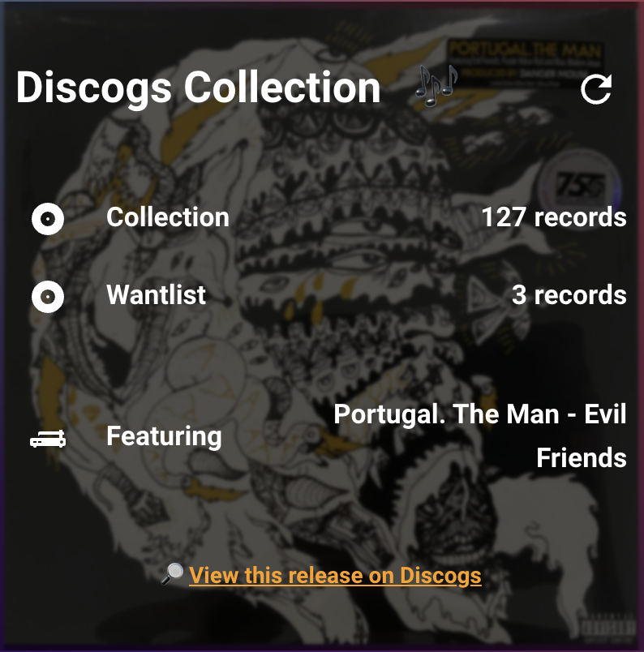

# Discogs for Home Assistant

[](https://github.com/hacs/integration)
[](https://github.com/trevnologies/ha-discogs/actions/workflows/validate.yml)

<p align="center">
  <table>
    <tr>
      <td></td>
      <td></td>
    </tr>
    <tr>
      <td></td>
      <td></td>
    </tr>
  </table>
</p>

Home Assistant sensor integration for Discogs — collection count, wantlist
count, and a random record suggestion from your collection.

## Installation

### HACS (Recommended)

[](https://my.home-assistant.io/redirect/hacs_repository/?owner=trevnologies&repository=ha-discogs&category=integration)

1. Click the badge above — opens your HA instance directly to the "add
   custom repository" dialog with this repo pre-filled (requires
   [My Home Assistant](https://www.home-assistant.io/integrations/my/),
   on by default for most setups)
2. Confirm, then find "Discogs" in HACS and install
3. Restart Home Assistant

Or manually:

1. HACS → Integrations → ⋮ (top right) → Custom repositories
2. Repository: `https://github.com/trevnologies/ha-discogs`, Category: Integration
3. Search for "Discogs" and install
4. Restart Home Assistant

### Manual (no HACS)

Copy `custom_components/discogs` into your `/config/custom_components/`
directory and restart Home Assistant.

## Configuration

[](https://my.home-assistant.io/redirect/config_flow_start/?domain=discogs)

1. Get a personal access token from your
   [Discogs developer settings](https://www.discogs.com/settings/developers)
2. Settings → Devices & services → Add integration → **Discogs** (or click
   the badge above)
3. Enter the token. Leave **Name** as `Discogs` unless you have a reason to
   change it — the name is used for the entity IDs, and the default gives
   `sensor.discogs_collection`, `sensor.discogs_wantlist`, and
   `sensor.discogs_random_record`, which the dashboard card in `extras/`
   expects

### Adjusting the refresh interval

The integration polls Discogs every hour by default. To change it, open
the Discogs integration and click **Configure** — the interval is in
minutes (5 to 1440). Each refresh updates all three sensors from a single
fetch and picks a new random record.

If you're using the `extras/` dashboard pipeline, this interval also
paces the whole card-refresh chain — the automation in
`extras/automations.yaml` triggers off `sensor.discogs_random_record`
changing state, so a shorter interval means the cover art refreshes more
often too.

### Upgrading from YAML (1.0.x)

Earlier versions were configured in `configuration.yaml`:

```yaml
sensor:
  - platform: discogs
    token: !secret discogs_token
```

Nothing needs to be done before updating. On the first restart after
updating to 1.1.0, that YAML is imported into the new UI setup
automatically:

- Entity IDs stay the same, so automations, scripts, and dashboards keep
  working
- `name` becomes the integration's name, `scan_interval` becomes the
  polling-interval option, and any sensors you'd left out of
  `monitored_conditions` are created but disabled
- A repair notice then appears under Settings → System → Repairs. Remove
  the `platform: discogs` block from `configuration.yaml` and restart to
  clear it. YAML setup is deprecated and will be removed in a future
  release

If the import can't reach Discogs or the token is rejected, a repair
notice explains what failed; fix it and restart, or delete the YAML and
set the integration up from the UI instead.

## Entities Created

### Sensors
- `sensor.discogs_collection` — total records in your collection
- `sensor.discogs_wantlist` — total records on your wantlist
- `sensor.discogs_random_record` — a random pick from your collection,
  refreshed each poll

## Optional: Dashboard Card + Auto-Refreshing Cover Art

See [`extras/README.md`](extras/README.md) for the full setup — an
automation, script, shell command, a couple of file sensors, and a
dashboard card that together show a random record with cover art that
refreshes automatically. Not required for the core integration to work;
purely a nice-to-have on top of it.

## Troubleshooting

### Integration not found after install
1. Confirm files are in `config/custom_components/discogs/`
2. Check `manifest.json` exists in that folder
3. Restart Home Assistant fully
4. Clear your browser cache

### Sensors show "unknown" or don't update
1. Check Settings → System → Repairs and the integration card for a
   re-authentication prompt — if Discogs rejects the token, Home Assistant
   asks for a new one there
2. Check the polling interval under the integration's **Configure** option
3. Check Settings → System → Logs for API errors. Occasional "keeping last
   known values" warnings are normal: Discogs sometimes throttles or
   returns a bad response, and the sensors keep their previous values
   until the next successful poll

### Dashboard card / cover art not refreshing
This is part of the optional `extras/` pipeline, not the core
integration — see [`extras/README.md`](extras/README.md) for its own
troubleshooting steps.

### Enable debug logging
Add to `configuration.yaml`:
```yaml
logger:
  default: info
  logs:
    custom_components.discogs: debug
```
Then restart and check Settings → System → Logs.

## FAQ

**Home Assistant core has a Discogs integration — why use this one?**
Core's `discogs` integration (by [@thibmaek](https://github.com/thibmaek))
is where this fork started, and its config flow (new in core 2026.10) has
been ported here. This fork adds what core doesn't have yet: one shared
Discogs fetch per poll instead of one per sensor (core's three sensors
each call the API separately, which Discogs throttles), keeping the last
known values when Discogs returns a bad response, a configurable polling
interval, re-authentication, and the `extras/` dashboard pipeline.

Installing this integration replaces core's Discogs integration — they
share the `discogs` domain, which is why the repo's hassfest check shows a
"Domain collides with built-in core integration" warning. That warning is
expected.

**How do I know when core's version changes?**
A weekly workflow (`.github/workflows/upstream-sync-check.yml`) watches
core's `discogs` integration and opens an issue labeled `upstream-sync`
with the diff when it changes, so improvements can be ported here.

**Do I need a paid Discogs account?**
No — a free Discogs account and a personal access token from your
[developer settings](https://www.discogs.com/settings/developers) is
all that's required.

## Attribution

Based on Home Assistant core's `homeassistant.components.discogs`,
written by [@thibmaek](https://github.com/thibmaek), and maintained here
as a standalone custom integration.

## Contributing

Run the tests with:

```bash
pip install -r requirements_test.txt
python -m pytest
```

Issues and pull requests welcome — [GitHub Issues](https://github.com/trevnologies/ha-discogs/issues).

## License

Apache License 2.0 (inherited from home-assistant/core, the original
source of this integration).